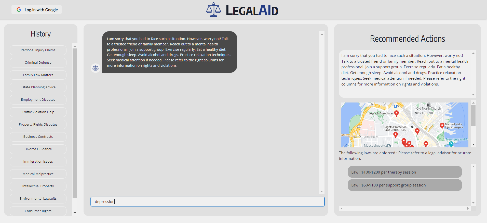

# LegalAId
_**Your AI Legal Assistant**_

LegalAId is an AI-powered legal assistant with a mission to organize the world's information and make it universally accessible. Our goal is to provide fast and efficient access to legal aid, ensuring that people have the information they need to understand and assert their rights. It's important to note that LegalAId is designed to guide users in the right direction and complement the work of legal professionals, not replace them. 

  

## Mission Statement

LegalAId has the potential to impact a large number of lives. We believe that everyone deserves to know their rights and have access to the legal assistance they need. Our platform is dedicated to making legal information accessible, ensuring that individuals can navigate their legal situations with confidence.

☁️ **LegalAId was made possible thanks to Google Cloud** ☁️

  

  
  

## Key Features

- **Custom-Trained Google Cloud PaLM Model**: Our platform begins with a custom-trained Google Cloud PaLM model, which is trained with legal data specific to the user's country and state.

- **Google Cloud Storage for Legal Documents**: We store legal documents using Google Cloud Storage, ensuring secure and reliable access.

- **Kubernetes Vector Search in GCP**: Vector search is set up using Kubernetes inside Google Cloud Platform, enabling fast and accurate retrieval of relevant legal information.

- **Serverless Access with IP Whitelisting**: Serverless access is provided to specific IP addresses, ensuring a streamlined and secure environment.

- **PDF to Embeddings with Google Vertex AI and Document AI**: We leverage Google Cloud's AI Vertex and Google Document AI to transform PDF pages into embeddings for our Elasticsearch instance, establishing a seamless connection in our pipeline.

- **Google Authentication**: Each user account is authenticated through Google Authentication, creating an efficient and secure user environment.

- **Python and Flask for Backend**: The entire backend of LegalAId is developed in Python, with Flask as the web framework.

- **Intuitive Frontend with JavaScript, React, ChakraUI, and Vite**: The frontend is designed to be user-friendly and intuitive, utilizing JavaScript, React, ChakraUI, and Vite. NodeJS is used for managing various aspects of the platform.

- **Google Vertex AI-Powered Chat-bot**: We've integrated a chat-bot powered by Google Vertex AI, providing accurate and precise responses to user inquiries.

- **Classification Models for Legal Situations**: Using Google Vertex AI, we employ classification models to understand the exact laws most relevant to the user's situation and identify the human rights most affected by the incident. This information forms the basis for LegalAId's recommendations.

- **Recommended Legal Attorneys with Google Maps API**: LegalAId goes a step further by recommending experienced legal attorneys along with their location, leveraging the Google Maps API to provide users with the best possible service for their case.

## How to Run this WebApp:

## Installation and Usage

1. **Clone the Repository**:
   - Command: `git clone <repository_URL>`
   - Description: Retrieve a copy of the project from the specified Git repository.

2. **Install Dependencies**:
   - Command: `npm i`
   - Description: Use Node Package Manager (npm) to install all required project dependencies.

3. **Run Backend Server**:
   - Command: `cd backend; python3 app.py`
   - Description: Navigate to the backend directory and execute the Flask application using Python 3. Ensure that any occurrences of `python` in `app.py` are replaced with `python3`.

4. **Install Backend Dependencies**:
   - Command: `cd backend; python3 app.py`
   - Description: This command, executed in the backend directory, installs all necessary backend dependencies.

5. **Run Frontend Development Server**:
   - Command: `cd frontend; npm run dev`
   - Description: Navigate to the frontend directory and initiate the development server using npm.

6. **Access the Application**:
   - Description: Open a web browser and go to `localhost:<port_number>` (replace `<port_number>` with the specified port) to access the application.

7. **Follow Guidelines**:
   - Description: Refer to the provided guidelines or instructions for further usage.

8. **Login using Google OAuth (Optional)**:
   - Description: Optionally, you can choose to log in using Google OAuth for enhanced authentication and user experience. Follow the relevant prompts or instructions provided within the application.

## Our results

- **API Metrics**:

  

- **Elastic Search on Kubernetes Engine**:

  

- **Setting Up Buckets in GCP for Storage of Dataset**:

  

- **And fwinally, our WebApp 🎉🙌🥳**:

  

## Meet the team
_**In order from left to right**_

  

_**Ramiro Garza, Adolfo Gonzalez, David J. Malan (not in the team, just in the picture), Daniel Chen, Chaitanya Chaurasia**_
